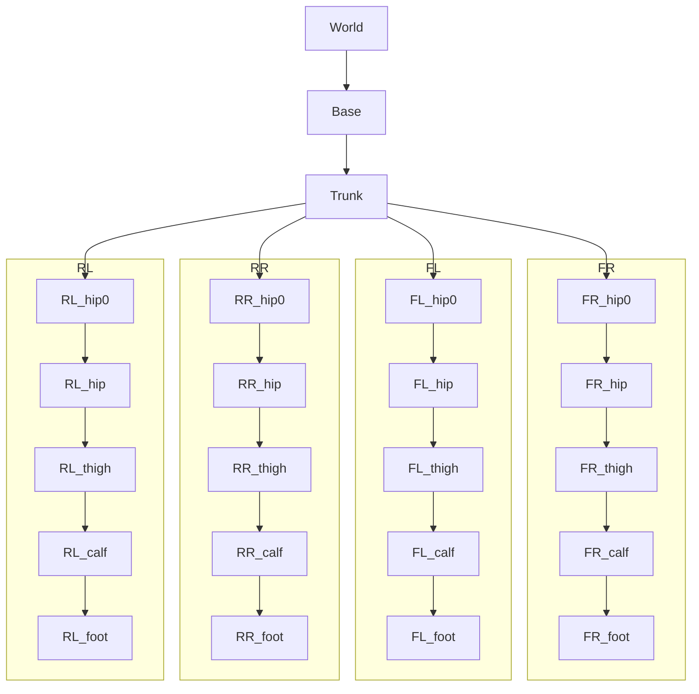

Reference frames representation:

 
<em>Oblique view</em>

  

<table>
<tr>
<td align="center">
 
<em>(a) Front view</em>
</td>

<td align="center">
 
<em>(b) Side view</em>
</td>
</tr>
</table>

<b>Figure 1:</b> Illustration of the frames assigned to the robot leg.

Frame tree:

Transformation Matrices from the hip-origin frame to the foot frame: 
$$
    \prescript{0}{1}{T} = \begin{bmatrix}
      1 & 0 & 0 & 0 \\
      0 & c_{0} & -s_{0} & 0 \\
      0 & s_{0} & c_{0} & 0 \\
      0 & 0 & 0 & 1
    \end{bmatrix},
    \prescript{1}{2}{T} = \begin{bmatrix}
      c_{2} & 0 & s_{2} & 0 \\
      0 & 1 & 0 & -l_{1} \\
      -s_{2} & 0 & c_{2} & 0 \\
      0 & 0 & 0 & 1
    \end{bmatrix},
    \prescript{2}{3}{T} = \begin{bmatrix}
      c_{3} & 0 & s_{3} & 0 \\
      0 & 1 & 0 & 0 \\
      -s_{3} & 0 & c_{3} & -l_{2} \\
      0 & 0 & 0 & 1
    \end{bmatrix},
    \prescript{3}{4}{T} = \begin{bmatrix}
      1 & 0 & 0 & 0 \\
      0 & 1 & 0 & 0 \\
      0 & 0 & 1 & -l_{3} \\
      0 & 0 & 0 & 1
    \end{bmatrix}
    \tag{M.T01}
$$
The homogeneous transformation matrix $\prescript{0}{4}{T}$:
$$
    \prescript{0}{4}{T} = \prescript{0}{1}{T} \, \prescript{1}{2}{T} \, \prescript{2}{3}{T} \, \prescript{3}{4}{T} = \begin{bmatrix}
      c_{12} & 0 & s_{12} & -l_{2}s_{1}-l_{3}s_{12} \\
      s_{0}s_{12} & c_{0} & -s_{0}c_{12} & -l_{1}c_{0}+s_{0}(l_{2}c_{1}+l_{3}c_{12}) \\
      -c_{0}s_{12} & s_{0} & c_{0}c_{12} & -l_{1}s_{0}-c_{0}(l_{2}c_{1}+l_{3}c_{12}) \\
      0 & 0 & 0 & 1
    \end{bmatrix}
    \tag{eq.T04}
$$
The fixed transformation matrix from the base frame to the hip-origin frame is given by: 
$$
    \prescript{B}{H}{T} = \prescript{B}{0}{T} = \begin{bmatrix}
        I_3 & p^{B}_{H} \\
        0^\top & 1
    \end{bmatrix} = \begin{bmatrix}
      1 & 0 & 0 & \pm l_{x}/2 \\
      0 & 1 & 0 & \pm l_{y}/2 \\
      0 & 0 & 1 & 0 \\
      0 & 0 & 0 & 1
    \end{bmatrix}
    \tag{eq.Th}
$$
with $l_1 = 0.0955$m for right legs, $l_1 = -0.08$m for left legs, $l_2 = l_3 = 0.213$m , $l_x = 0.3868$m and $l_y = 0.093$m,  $c_{i} = \cos(\mathbf{q_{i}})$, $s_{i} = \sin(\mathbf{q_{i}})$, $c_{ij} = \cos(\mathbf{q_{i}} + \mathbf{q_{j}})$, $s_{ij} = \sin(\mathbf{q_{i}} + \mathbf{q_{j}})$.
