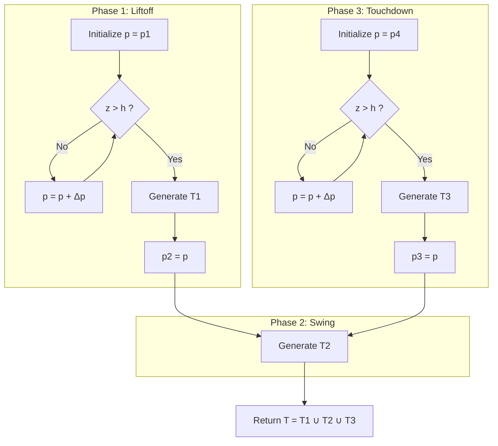

The proposed design uses a multi-segment trajectory structure composed of three distinct motion phases:
1. Liftoff: the foot exits the substrate against resistive forces;
2. Swing: the foot swings above the surface;
3. Touchdown: the foot re-enters the terrain to establish ground contact
> [!algorithm] Multi-Segment Foot Trajectory Generation
>
> **Input**
> - Current foot pose `p1`
> - Desired landing pose `p4`
> - Estimated ground depth `h`
>
> **Output**
> - Full trajectory `T = T1 ∪ T2 ∪ T3`
>
> ---
>
> ### Liftoff Segment
>
> Initialize `p = p1`
>
> while `z ≤ h`
> - `p = p + Δp`
> - append `p` to `T1`
>
> Set `p2 = p`
>
> ---
>
> ### Touchdown Segment
>
> Initialize `p = p4`
>
> while `z ≤ h`
> - `p = p + Δp`
> - append `p` to `T3`
>
> Set `p3 = p`
>
> ---
>
> Generate:
> - `T1` using cubic spline interpolation from `p1 → p2`
> - `T2` using quintic interpolation from `p2 → p3`
> - `T3` using cubic spline interpolation from `p3 → p4`
>
> Return:
>
> `T = T1 ∪ T2 ∪ T3`

